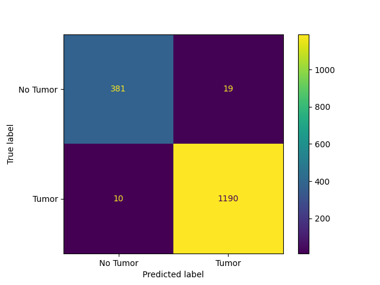
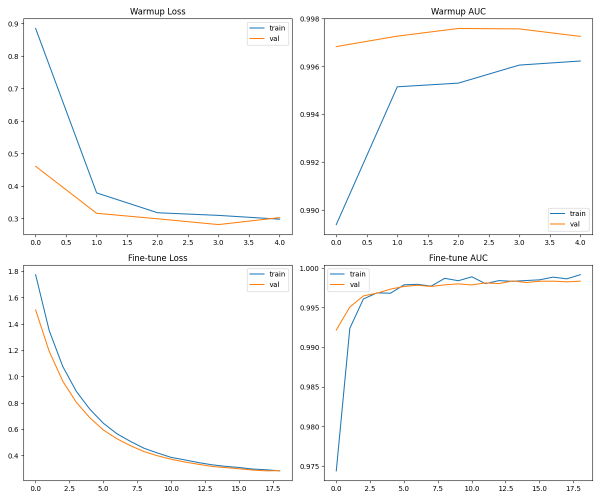
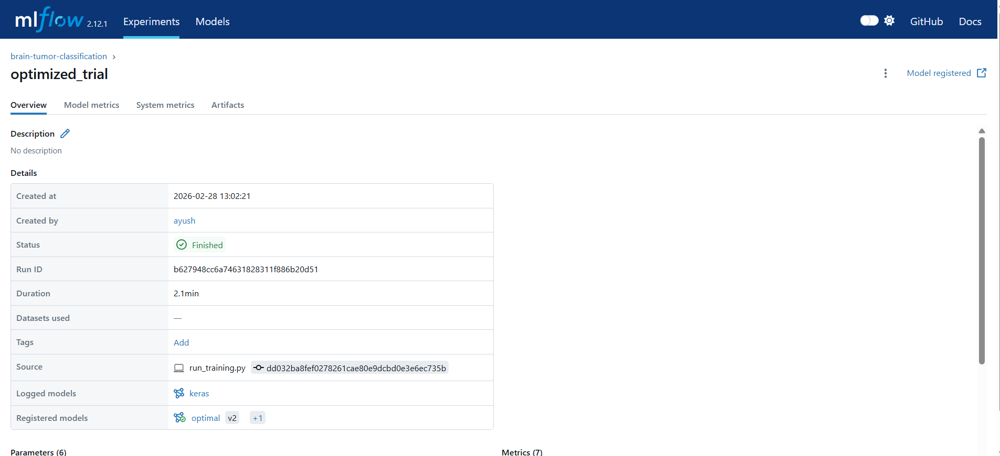
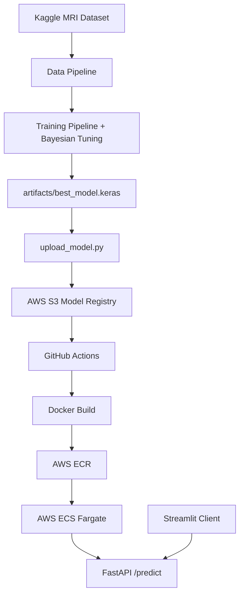
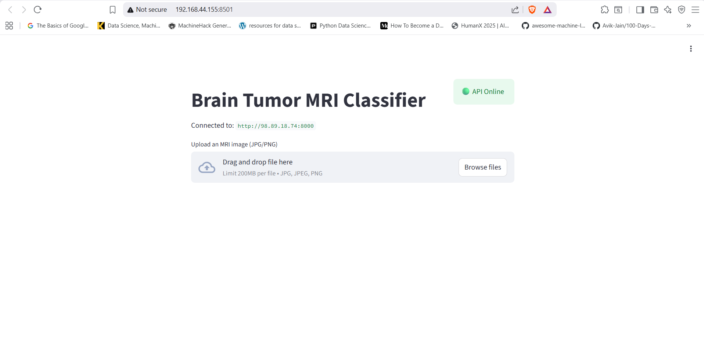

# DL-Clf-ENDtoEND

Production-grade binary Brain Tumor MRI classification system with Bayesian hyperparameter optimization, MLflow experiment tracking, and automated AWS deployment.

[](https://youtu.be/GdkqQOeT4nU)

> Full system demonstration and architecture walkthrough: [youtu.be/GdkqQOeT4nU](https://youtu.be/GdkqQOeT4nU)

---

## System Overview

This repository implements a complete ML lifecycle for classifying Brain Tumor MRI scans into **Tumor** or **No Tumor** categories. The pipeline spans data ingestion from Kaggle, automated hyperparameter search via Bayesian Optimization, experiment tracking with MLflow, and zero-touch deployment to AWS ECS Fargate through GitHub Actions. The inference service exposes a FastAPI REST endpoint consumed by a local Streamlit client for verification.

The original dataset contains four classes (glioma, meningioma, pituitary, notumor). The `DataValidator` in `src/data_pipeline/data_validation.py` maps these to a binary label scheme: all tumor subtypes collapse to class 1, `notumor` maps to class 0.

---

## Dataset

The model is trained on the publicly available **Brain Tumor MRI Dataset**, curated for deep-learning-based tumor classification from MRI scans.

**Source**: [Brain Tumor MRI Dataset on Kaggle](https://www.kaggle.com/datasets/masoudnickparvar/brain-tumor-mri-dataset)

| Property | Value |
| :--- | :--- |
| Total images | 7,200 |
| Raw classes | glioma, meningioma, pituitary, notumor |
| Binary mapping | notumor = 0, all tumors = 1 |
| Splits | Training / Testing (Kaggle native) |
| Validation | 20% stratified sample of Training set |
| Image format | JPEG, resized to 224x224x3 |

Data is version-controlled using DVC. The `data.dvc` pointer file tracks the exact dataset hash used for each training run.

---

## Key Capabilities

- **Bayesian Hyperparameter Optimization**: 10-trial search over learning rate, dropout, dense units, L2 regularization, and backbone unfreezing depth using KerasTuner.
- **Experiment Tracking and Model Registry**: Every trial and the final optimized run are logged to MLflow with dataset fingerprints (SHA-256), parameters, and evaluation artifacts.
- **Data Version Control**: DVC anchors each model version to a specific dataset hash, enabling full lineage tracking.
- **Cloud-Native Inference**: Containerized FastAPI service on AWS ECS Fargate with automatic S3-to-local model fallback on cold starts.
- **Structured Observability**: JSON-formatted request and inference logs via `structlog`, piped to CloudWatch in production.

---

## Model Performance

Evaluated on the hold-out test set (1,600 images). Threshold optimized via precision-recall curve analysis in `ModelEvaluator`.

**Accuracy: 98.19%**

| Metric | Class 0 (No Tumor) | Class 1 (Tumor) |
| :--- | :--- | :--- |
| Precision | 0.9744 | 0.9843 |
| Recall | 0.9525 | 0.9917 |
| F1-Score | 0.9633 | 0.9880 |

**Macro F1**: 0.9756 | **Weighted F1**: 0.9818

### Confusion Matrix

| | Predicted Negative | Predicted Positive |
| :--- | :---: | :---: |
| **Actual Negative** | 381 (TN) | 19 (FP) |
| **Actual Positive** | 10 (FN) | 1,190 (TP) |

The false negative rate of 0.83% is critical for a diagnostic support system where missed tumors carry the highest risk.



---

## Training Dynamics

The model uses an EfficientNetV2-S backbone with a custom classification head. Training operates under mixed-precision (float16) to optimize memory and throughput. Convergence is managed through `EarlyStopping` (patience=5, monitoring `val_auc`) and `ModelCheckpoint` (save best only).

Fine-tuning runs for up to 20 epochs with a learning rate decayed to 1/10th of the Bayesian-selected optimum. Inverse-frequency class weighting compensates for the 3:1 tumor-to-normal imbalance.



---

## Hyperparameter Optimization

Architecture search executed via `keras_tuner.BayesianOptimization` with `val_auc` as the maximization objective. 10 trials were evaluated, each running for up to 5 epochs with early stopping (patience=2).

**Best Trial: 09**

| Parameter | Search Range | Optimal Value |
| :--- | :--- | :--- |
| Learning Rate | 1e-5 to 1e-2 (log) | 9.77e-05 |
| Unfrozen Backbone Layers | 0 to 50 (step 10) | 30 |
| Dense Units | 128 to 512 (step 128) | 256 |
| Dropout Rate | 0.2 to 0.7 (step 0.1) | 0.4 |
| L2 Regularization | 1e-5 to 1e-2 (log) | 0.00224 |

**Trial 09 Validation Metrics:**
- Accuracy: 99.11%
- AUC: 0.9998
- Best Epoch: 4

The aggressive unfreezing of 30 backbone layers combined with moderate regularization (dropout 0.4, L2 0.00224) enabled the model to adapt ImageNet features to the MRI domain without overfitting. Configuration stored in `artifacts/tuner/mri_brain_tuner/trial_09/trial.json`.

---

## MLflow Experiment Tracking

All training runs are tracked in the local MLflow server under the `brain-tumor-classification` experiment. Each tuner trial logs its hyperparameters and `val_auc` as a separate run. The final optimized model is archived with its dataset SHA-256 hash, evaluation metrics, confusion matrix JSON, and classification report.



---

## End-to-End Architecture



Detailed component-level architecture is documented in [`docs/architecture_diagram.mmd`](docs/architecture_diagram.mmd).

---

## Inference Flow

The `InferencePipeline` class (`src/inference_pipeline/infer.py`) manages the complete prediction lifecycle:

1. **Model Loading**: On startup, `InferencePipeline` loads `best_model.keras` from the local filesystem. If the file is absent (ECS cold start), it automatically downloads from S3 using `boto3`.
2. **Preprocessing**: Raw image bytes are decoded, resized to 224x224, and scaled using `tf.keras.applications.efficientnet_v2.preprocess_input` to match the training pipeline exactly.
3. **Prediction**: Single forward pass through the loaded Keras model. The sigmoid output is compared against the configurable `confidence_threshold` (default: 0.5).
4. **Response**: Standardized JSON containing `label`, `probability`, and `class_idx`.



---

## MLOps Lifecycle

| Stage | Tool | Implementation |
| :--- | :--- | :--- |
| Data Versioning | DVC | `data.dvc` tracks dataset hash; `dvc pull` restores exact training data |
| Experiment Tracking | MLflow | Per-trial params, metrics, and model artifacts logged and registered |
| Model Storage | AWS S3 | `upload_model.py` pushes `best_model.keras` to the central registry |
| Containerization | Docker | Multi-dependency `python:3.12-slim` image built from `infra/Dockerfile` |
| Deployment | ECS Fargate | Zero-downtime rolling update triggered by GitHub Actions |
| Monitoring | structlog + CloudWatch | JSON logs streamed via `awslogs` driver from ECS tasks |

---

## Repository Structure

```
.
├── apps/
│   └── streamlit_app.py          # Local inference test client
├── artifacts/
│   ├── eval/                     # confusion_matrix.json, report.json
│   ├── plots/                    # cm.png, training_curves.png
│   ├── tuner/                    # KerasTuner trial configs and weights
│   └── best_model.keras          # Final trained model checkpoint
├── configs/
│   └── model_config.yaml         # Model architecture and data mapping config
├── docs/
│   ├── images/                   # README screenshots and diagrams
│   ├── architecture_diagram.mmd  # Mermaid system architecture
│   ├── setup_guide.md            # Environment setup instructions
│   └── troubleshooting.md        # Real-world debugging reference
├── infra/
│   ├── Dockerfile                # Production inference container
│   ├── provision.sh              # One-time AWS resource provisioning
│   └── task_definition.json      # ECS Fargate task configuration
├── src/
│   ├── api/
│   │   ├── app.py                # FastAPI application (/health, /predict)
│   │   └── middleware.py         # Request/response logging middleware
│   ├── common/
│   │   ├── config.py             # Pydantic settings loaded from .env + YAML
│   │   ├── logging.py            # structlog configuration
│   │   └── utils.py              # Hashing and DVC utilities
│   ├── data_pipeline/
│   │   ├── data_ingestion.py     # Kaggle API dataset download
│   │   ├── data_validation.py    # 4-class to binary label mapping
│   │   └── preprocessing.py      # tf.data pipeline with augmentation
│   ├── inference_pipeline/
│   │   └── infer.py              # Model loading (S3 fallback) + prediction
│   └── training_pipeline/
│       ├── build_model.py        # EfficientNetV2-S architecture construction
│       ├── evaluate.py           # Threshold optimization + metrics + artifacts
│       ├── mlflow_tracking.py    # MLflow logging service
│       ├── train.py              # Master orchestrator (full lifecycle)
│       └── tuner.py              # Bayesian hyperparameter search
├── tests/
│   ├── test_api.py               # FastAPI endpoint integration tests
│   └── test_model.py             # Model architecture unit tests
├── .github/workflows/
│   └── deploy.yml                # CI/CD pipeline (ECR + ECS deployment)
├── upload_model.py               # S3 model upload utility
├── data.dvc                      # DVC dataset pointer
├── requirements.txt              # Full dependency manifest
└── .env.example                  # Environment variable template
```

---

## Tech Stack

| Component | Technology | Rationale |
| :--- | :--- | :--- |
| Model | TensorFlow / Keras | Mature transfer learning ecosystem with production-grade serving support |
| Backbone | EfficientNetV2-S | Parameter-efficient architecture with strong ImageNet pretraining |
| HP Search | KerasTuner (Bayesian) | Sample-efficient search compared to random/grid, converges in fewer trials |
| Tracking | MLflow | Centralized experiment tracking with model registry and artifact storage |
| Data Versioning | DVC | Handles large binary datasets that cannot be stored in Git |
| API | FastAPI | Low-latency async inference with automatic OpenAPI documentation |
| Runtime | Docker | Reproducible environment from WSL2 development to AWS production |
| Model Store | AWS S3 | Durable storage for multi-hundred MB model artifacts |
| Container Registry | AWS ECR | Private registry with high-speed pulls within the AWS VPC |
| Compute | AWS ECS Fargate | Serverless containers eliminating instance management overhead |
| CI/CD | GitHub Actions | Event-driven automation on push to `main` |
| Testing UI | Streamlit | Lightweight local client for manual verification of deployed API |
| Logging | structlog | Machine-readable JSON output compatible with CloudWatch and ELK |

---

## Local Development

Full setup instructions: [`docs/setup_guide.md`](docs/setup_guide.md)

```bash
# Create and activate environment
python -m venv venv_deploy
source venv_deploy/bin/activate

# Install dependencies
pip install -r requirements.txt

# Configure secrets
cp .env.example .env
# Fill in AWS_ACCESS_KEY_ID, AWS_SECRET_ACCESS_KEY, KAGGLE_USERNAME, KAGGLE_KEY

# Run training pipeline
python -m src.training_pipeline.train

# Run Streamlit client
streamlit run apps/streamlit_app.py
```

---

## Cloud Deployment Pipeline

The deployment strategy uses rolling updates on AWS ECS Fargate. Infrastructure is provisioned once via `infra/provision.sh`, which creates the S3 bucket, ECR repository, ECS cluster, task definition, and service.

```
Model upload:     python upload_model.py  -->  S3
Docker build:     infra/Dockerfile        -->  python:3.12-slim image
Image registry:   docker push             -->  AWS ECR
Task update:      aws ecs update-service  -->  ECS Fargate (zero-downtime)
```

The Dockerfile is intentionally minimal: it copies only `src/`, `configs/`, and `artifacts/best_model.keras` into the production image.

---

## CI/CD Workflow

The `.github/workflows/deploy.yml` workflow automates deployment on every push to `main`:

1. **Checkout** repository.
2. **Configure** AWS credentials from GitHub Secrets.
3. **Login** to Amazon ECR.
4. **Download** `best_model.keras` from S3.
5. **Build** Docker image tagged with commit SHA and `latest`.
6. **Push** to ECR.
7. **Register** new ECS task definition with updated image URI.
8. **Update** ECS service with `--force-new-deployment`.
9. **Wait** for `services-stable` confirmation.
10. **Output** live public IP endpoint.

---

## Testing Strategy

Tests are located in `tests/` and executed via `pytest`.

| Test File | Coverage | Assertions |
| :--- | :--- | :--- |
| `test_model.py` | Model architecture | Output shape is `(None, 1)`, optimizer is `AdamW`, backbone is frozen when `unfreeze_layers=0` |
| `test_api.py` | API endpoints | `/health` returns 200 with `status` and `model_loaded` fields; `/predict` returns 422 without file upload |

---

## Observability and Logging

Logging is configured in `src/common/logging.py` using `structlog`. The system automatically selects JSON output in headless environments (production) and color-coded console output in interactive terminals.

The FastAPI middleware in `src/api/middleware.py` logs every request's method, path, and response status code. In AWS, these logs are routed to CloudWatch via the `awslogs` driver configured in `infra/task_definition.json`.

---

## Reproducibility

Reproducibility is enforced at three levels:

1. **Data**: `data.dvc` locks the dataset to a specific MD5 hash. Running `dvc pull` restores the exact training set.
2. **Randomness**: Global seeds are set for `tensorflow`, `numpy`, and `random` (seed=42) in both `train.py` and `tuner.py`.
3. **Configuration**: All hyperparameters and data mappings are externalized in `configs/model_config.yaml` and `.env`.

---

## Security and Secrets Handling

- **No credentials in source control**: `.env` is excluded via `.gitignore`. Only `.env.example` (with placeholder values) is committed.
- **Runtime injection**: `pydantic-settings` loads credentials from `.env` locally and from environment variables in ECS.
- **CI/CD secrets**: AWS credentials are stored in GitHub Secrets and injected into the workflow at runtime.
- **Network isolation**: ECS tasks run in the default VPC with public IP assignment for inference endpoints.

---

## Limitations

- **Binary scope**: The current model classifies Tumor vs. No Tumor only. It does not distinguish tumor subtypes.
- **CPU inference**: The production deployment uses CPU-only TensorFlow. GPU acceleration would require migrating to SageMaker or GPU-enabled ECS instances.
- **No model monitoring**: There is no automated drift detection or performance degradation alerting in the current deployment.
- **Single model version**: The S3 registry stores only `latest`; there is no A/B testing or canary deployment infrastructure.

---

## Future Work

- Grad-CAM integration for visual model explainability on MRI scans.
- Multi-class expansion to distinguish glioma, meningioma, and pituitary tumors.
- Automated data drift monitoring and model retraining triggers.
- A/B deployment support with traffic splitting between model versions.
- SageMaker migration for GPU-accelerated batch inference.

---

## References

- Dataset: [Brain Tumor MRI Dataset (Kaggle)](https://www.kaggle.com/datasets/masoudnickparvar/brain-tumor-mri-dataset)
- Project Demo: [YouTube Walkthrough](https://youtu.be/GdkqQOeT4nU)
- Troubleshooting: [`docs/troubleshooting.md`](docs/troubleshooting.md)
- Setup Guide: [`docs/setup_guide.md`](docs/setup_guide.md)
- Architecture: [`docs/architecture_diagram.mmd`](docs/architecture_diagram.mmd)

---

## License

This project is licensed under the [MIT License](LICENSE).
